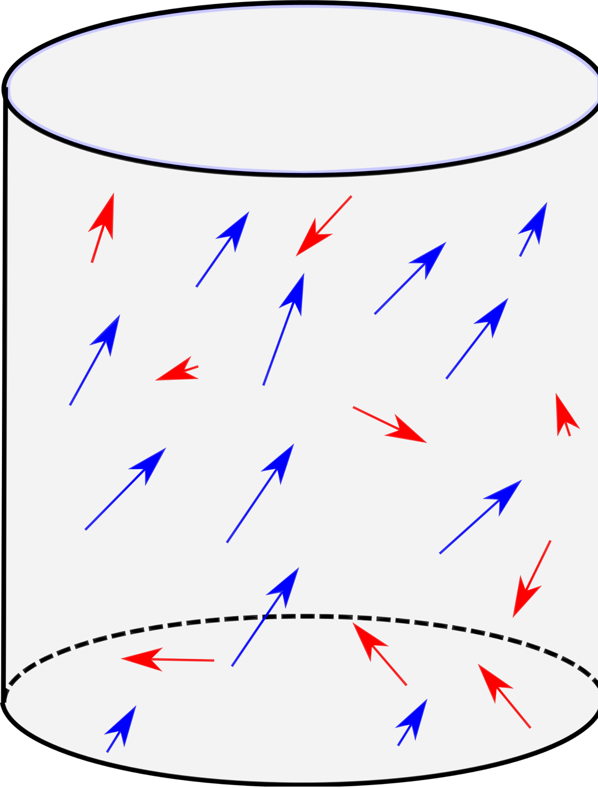
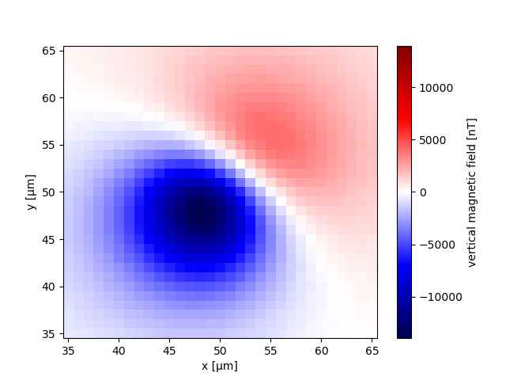
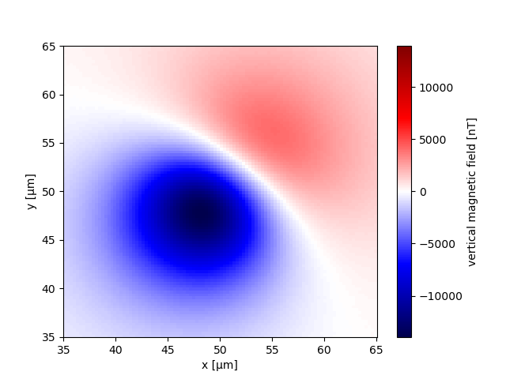
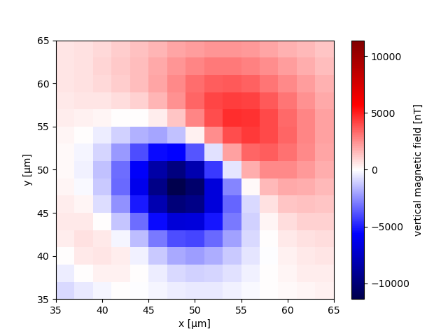
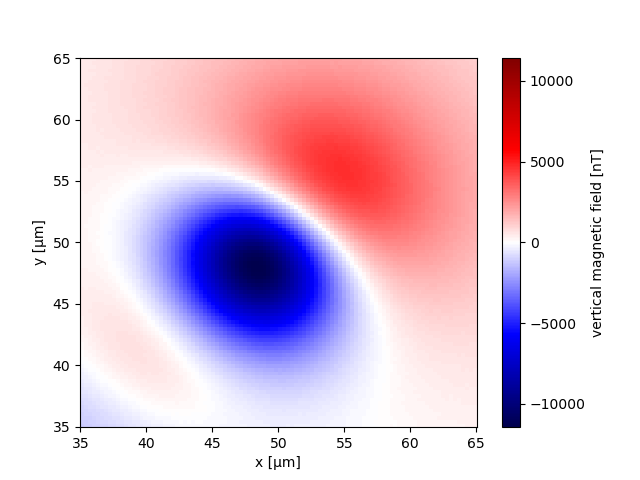
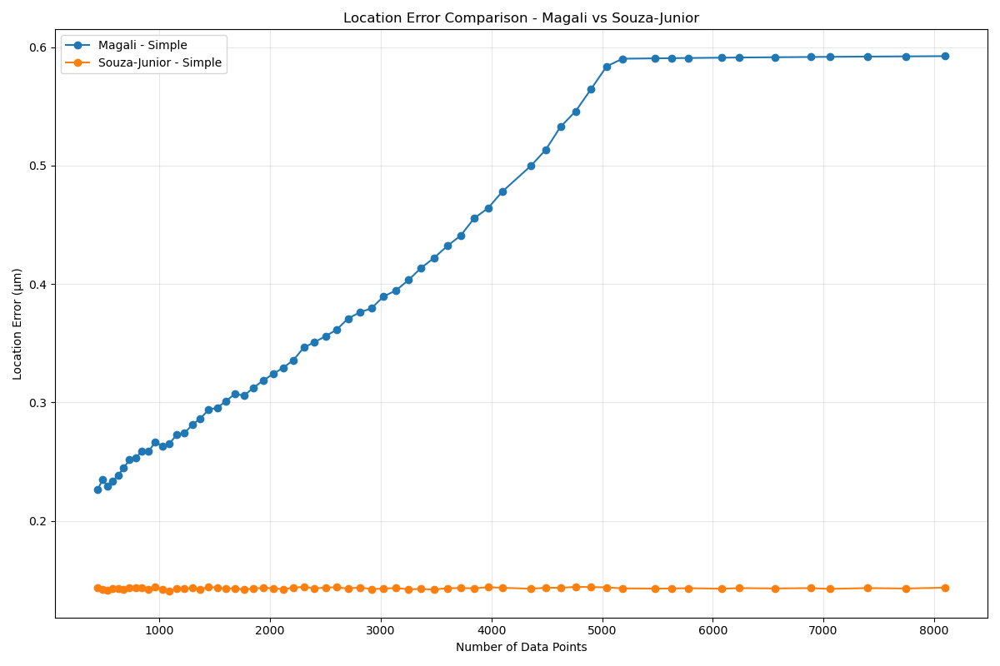
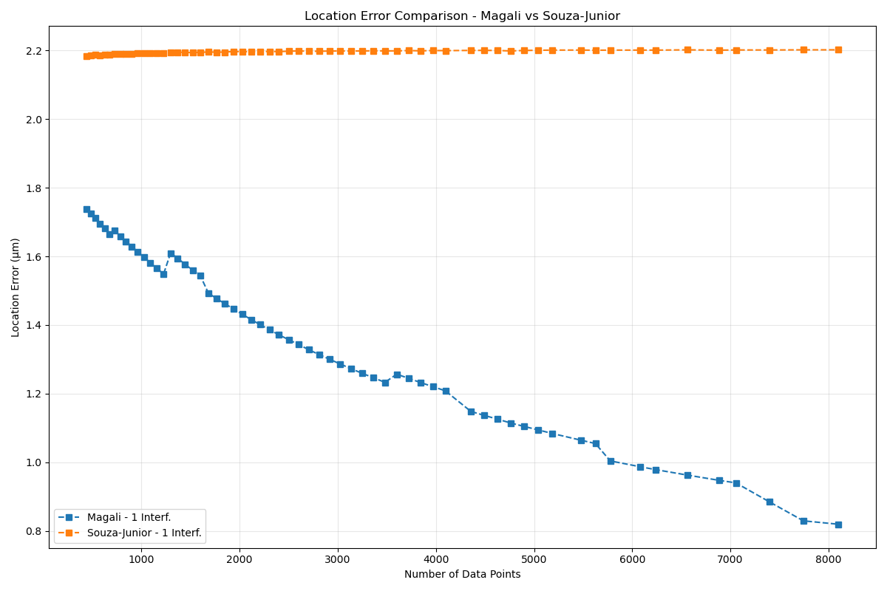
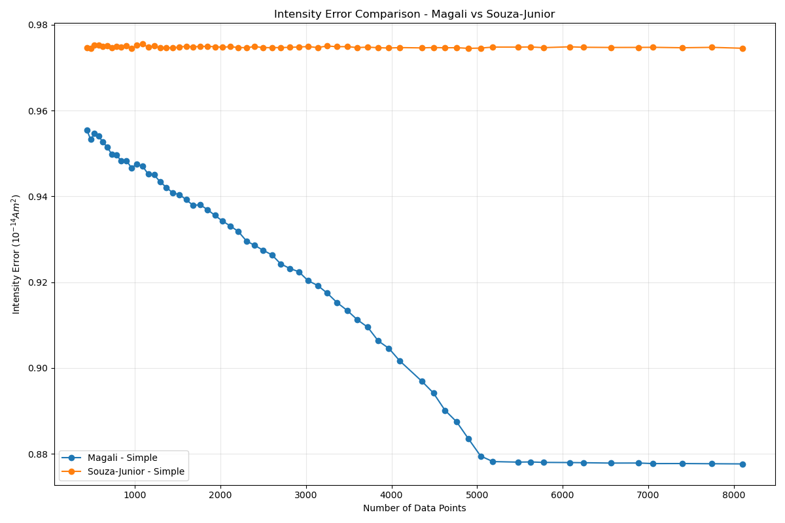
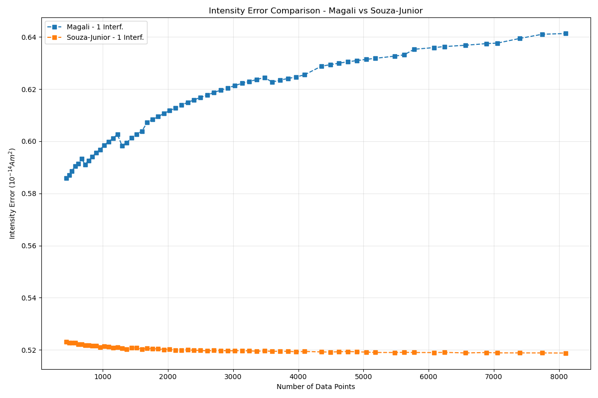
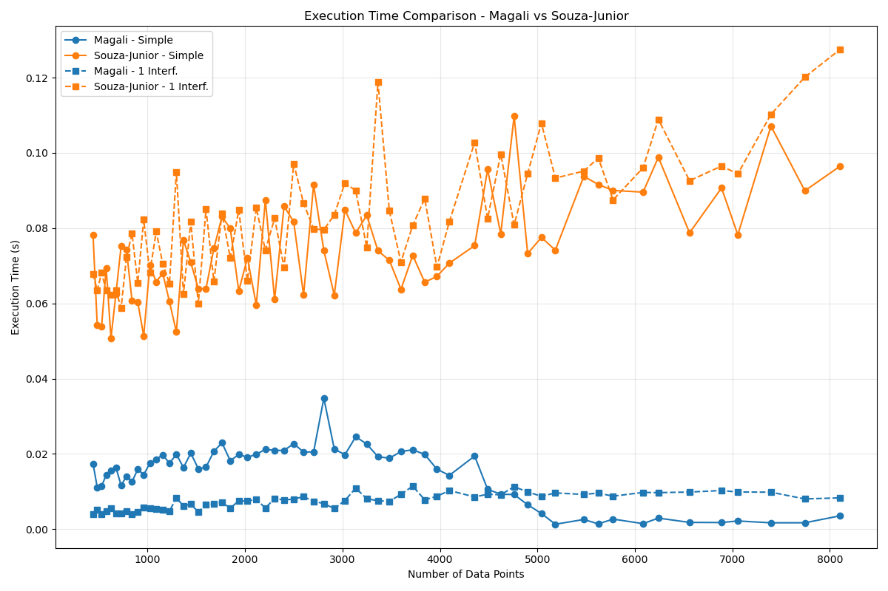

<!--
-------------------------------------------------------------------------------
This file defines the contents of each slide.
The reveal.js configuration can be found in index.html
-------------------------------------------------------------------------------
-->

<!-- .slide: class="slide-title" data-background-opacity="0.3" data-background-image="assets/magali-logo.svg" data-background-color="#000000" data-background-size="contain" -->

<!-- Place the content at the bottom of the slide -->

<h1 id="talk-title">
  
Magali: open software for inversion and analysis of magnetic microscopy data🧲🔬

</h1>

  <a id="talk-speaker"><b>Yago Moreira Castro</b></a>,
  Leonardo Uieda,
  Gelson Ferreira de Souza-Junior

<!-- Place location and date side-by-side with affiliation logos -->

<i class="fa fa-calendar-alt" style="margin: 0 10px 0 0"></i>
22 of May 2026

<!-- $8^{th}$ Biennial LATINMAG Meeti, Mexico -->

<!-- Permission to reuse and CC-BY license logo -->
<i class="fa fa-camera" style="margin: 0 10px 0 0"></i>
Feel free to screenshot/share/reuse this presentation

<a href="https://creativecommons.org/licenses/by/4.0/"><i class="fab fa-creative-commons"></i><i class="fab fa-creative-commons-by" style="margin: 0 10px 0 2px"></i>CC-BY 4.0 License</a>

<!-- Add logos here. Need these wrappers to align them to the bottom right -->

  
  
  

===============================================================================
# What is Paleomagnetism?

Application of magnetic measurements of rock minerals to solve geological problems

[Lisa Tauxe Lecture Notes](https://magician.ucsd.edu/SIO247/)

===============================================================================
# How are minerals magnetized?

- <!-- .element: class="fragment" -->
  - **Thermal Remanent Magnetization (TRM):** igneous rocks record the magnetic field as they cool below the Curie temperature (e.g., pure magnetite: **580°C**)

- <!-- .element: class="fragment" -->
  - **Depositional Remanent Magnetization (DRM):** magnetic particles in sediments align with the Earth's magnetic field during deposition in aquatic environments

===============================================================================
# Why is paleomagnetism important?

- <!-- .element: class="fragment" -->
  - **Geomagnetic reversals** show that the Earth's magnetic field has **reversed polarity** many times throughout its history

- <!-- .element: class="fragment" -->
  - Helped confirm the theory of **continental drift** and reconstruct past **positions** of the continents

- <!-- .element: class="fragment" -->
  - Used as a **relative dating** tool by comparing rock records with the known timescale of magnetic reversals **(magnetostratigraphy)**

- <!-- .element: class="fragment" -->
  - Makes it possible to understand how the Earth's **magnetic field** has **evolved** over hundreds of millions of years

===============================================================================
# Limitations of Paleomagnetism

- Overprinting by **secondary magnetizations** and the impossibility of **separating signals** from different minerals **without altering** sample properties (e.g., magnetite vs. hematite)

- Samples with **very weak signals** cannot overcome the background noise of conventional magnetometers

- Several methods **alter the sample**, either by modifying or destroying its magnetization

===============================================================================

  

===============================================================================

  

===============================================================================
# Quantum Diamond Microscope

- **The Data:** the QDM generates **magnetic field maps** of the sample's surface with **micrometric** spatial resolution at room temperature.

- **The Algorithmic Challenge:** the input is a dense N-dimensional grid with thousands of overlapping anomalous dipole sources. The desired output is the spatial positions ($x, y, z$) and magnetic moments ($m_x, m_y, m_z$) of each individual particle.

- **Desired output**: spatial positions ($x, y, z$) and magnetic moments ($m_x, m_y, m_z$) of each individual particle.

===============================================================================

  

 

[Harvard Paleomagnetics Lab](https://paleomag.fas.harvard.edu/laboratory)

===============================================================================

<!-- .slide: class="slide-title" data-background-opacity="1" data-background-image="assets/ceramic.png"  data-background-size="contain" -->

[Souza-Junior et al 2025](https://eartharxiv.org/repository/view/8869/)

===============================================================================

===============================================================================

  <b>Step 1 - Source detection</b>

  <b>Step 2 - Iterative processing (per window)</b>

<ul>
  <li class="text-left fragment" data-fragment-index="2">
    (a) <b>Data isolation:</b> select the magnetic data within the window
  </li>
  <li class="text-left fragment" data-fragment-index="3">
    (b) <b>Euler deconvolution:</b> estimate the source <em>position</em>
  </li>
  <li class="text-left fragment" data-fragment-index="4">
    (c) <b>Linear inversion:</b> estimate the dipole <em>moment</em> using a fixed position
  </li>
  <li class="text-left fragment" data-fragment-index="5">
    (d) <b>Nonlinear inversion:</b> refine position and moment via 
    <a href="https://academic.oup.com/comjnl/article-abstract/7/4/308/354237?redirectedFrom=fulltext">Nelder-Mead</a>
  </li>
  <li class="text-left fragment" data-fragment-index="7">
    (e) <b>Signal removal:</b> directly model the dipole and subtract it from the full dataset
  </li>
</ul>

  <b>Step 3 - Repeat detection on the residual data:</b>
  apply steps 1 and 2 to the residual dataset

===============================================================================
<!-- .slide: data-background-opacity="1" data-background-image="assets/readme-banner.png"  data-background-size="contain" data-background-color="#262626" -->

===============================================================================
<!-- .slide: data-background-opacity="0.2" data-background-image="assets/magali-logo.png"  data-background-size="contain" data-background-color="#262626" -->

# Why do we want to make it?

- Provide an **easy-to-use** codebase

- Determine the **spatial positions** of **multiple** grains

- Facilitate the creation of **synthetic data**

- Propose a **standard data format** for magnetic microscopy

- Serve as a **foundation** for developing new methods

- Explore the potential of emerging studies in **magnetic microscopy**

===============================================================================
<!-- .slide: data-background-opacity="0.2" data-background-image="assets/magali-logo.png"  data-background-size="contain" data-background-color="#262626" -->

Magali

Free and open-source  

<i class="fab fa-github"></i> <i class="fas fa-lock-open"></i> <i class="fab fa-osi"></i>

Python library  <i class="fab fa-python"></i>

Modeling and processing magnetic microscopy data  
<i class="fas fa-magnet"></i> <i class="fas fa-microscope"></i>

===============================================================================

<!-- .slide: data-background-opacity="0" data-background-image="assets/installing-pip.png"  data-background-size="contain" data-background-color="#080808e6" -->
<section>

<pre class="compact"><code class="python" data-trim data-noescape>
  import magali as mg
  import numpy as np
  import matplotlib.pyplot as plt
  import skimage.exposure
  import ensaio
  import harmonica as hm
</code></pre>
</section>

===============================================================================
<!-- .slide: data-background-opacity="0" data-background-image="assets/installing-pip.png"  data-background-size="contain" data-background-color="#080808e6" -->

<section>

<pre class="compact"><code class="python" data-trim data-noescape>
data_paths = {
    # Use Ensaio to get the dataset
    "speleothem": ensaio.fetch_morroco_speleothem_qdm(
        version=1,
        file_format="matlab",
    ),
    "ceramic": "data/ceramic/NRM1.mat",
    "basalt": "data/basalt/NRM1.mat",
}
</code></pre>
</section>

===============================================================================
<!-- .slide: data-background-opacity="0" data-background-image="assets/installing-pip.png"  data-background-size="contain" data-background-color="#080808e6" -->

<section>

<pre class="compact"><code class="python" data-trim data-noescape>

# Process each dataset, but using slightly different parameters
size_ranges = {"speleothem": [20, 150], "ceramic": [10, 150], "basalt": [10, 30]}
detection_thresholds = {"speleothem": 0.02, "ceramic": 0.02, "basalt": 0.002}
datasets, locations, dipole_moments, bounding_boxes = {}, {}, {}, {}
</code></pre>
</section>

===============================================================================
<!-- .slide: data-background-opacity="0" data-background-image="assets/installing-pip.png"  data-background-size="contain" data-background-color="#080808e6" -->

<section>

<pre class="compact"><code class="python" data-trim data-noescape>

for name in ["speleothem", "ceramic", "basalt"]:
    # Use Magali to load the data in Matlab Harvard QDM format
    datasets[name] = mg.read_qdm_harvard(data_paths[name])
</code></pre>
</section>

===============================================================================
<!-- .slide: data-background-opacity="0" data-background-image="assets/installing-pip.png"  data-background-size="contain" data-background-color="#080808e6" -->

<section>

<pre class="compact"><code class="txt" data-trim data-noescape>
xarray.DataArray 'bz' (y: 600, x: 960)> Size: 5MB
array([[ 352.40587477,   94.8913792 ,   41.61924299, ...,  470.18833933,
         129.20055397,   18.50120941],
       [ 525.04809649,  624.84659897,   53.45418   , ...,  450.42515609,
         240.12455308,  -73.61367693],
       [ 105.0939369 ,  638.76559489,  307.60736872, ...,  236.91326522,
         386.8498122 ,  -86.44215589],
       ...,
       [ -83.74367957,   32.98078244, -411.75073652, ...,  745.99373583,
        1036.20033954, -140.64317643],
       [ 171.17113661, -214.47801235,  159.23437984, ...,  124.58138395,
         258.54331931,  -90.3376945 ],
       [  80.60950354,  273.08367487,  118.23499313, ...,   -4.19572521,
         -53.55728012,    2.10335918]])
Coordinates:
  * x        (x) float64 8kB 0.0 2.35 4.7 7.05 ... 2.249e+03 2.251e+03 2.254e+03
  * y        (y) float64 5kB 0.0 2.35 4.7 7.05 ... 1.403e+03 1.405e+03 1.408e+03
    z        (y, x) float64 5MB 5.0 5.0 5.0 5.0 5.0 5.0 ... 5.0 5.0 5.0 5.0 5.0
Attributes:
    long_name:  vertical magnetic field
    units:      nT
</code></pre>
</section>

===============================================================================
<!-- .slide: data-background-opacity="0" data-background-image="assets/installing-pip.png"  data-background-size="contain" data-background-color="#080808e6" -->

<section>

<pre class="compact"><code class="python" data-trim data-noescape>

for name in ["speleothem", "ceramic", "basalt"]:
     # Use Magali to load the data in Matlab Harvard QDM format
    datasets[name] = mg.read_qdm_harvard(data_paths[name])
    # Upward continue the data 5 micrometers using Harmonica
    height_difference = 5
    data_up = (
        hm.upward_continuation(datasets[name], height_difference)
        .assign_attrs(datasets[name].attrs)
        .assign_coords(x=datasets[name].x, y=datasets[name].y)
        .assign_coords(z=datasets[name].z + height_difference)
        .rename("bz")
    )
    # Calcule data derivatives and TGA, which enhances the signals close to the source
    data_tga = mg.total_gradient_amplitude_grid(data_up)

===============================================================================
# Derivatives and TGA

- The **Total Gradient Amplitude (TGA)** of a harmonic function (which may represent the magnetic field) is calculated as the norm of the gradient vector:

$$||\vec{\mathbf{\nabla}}f(x, y, z)|| = \sqrt{(\partial_x f)^2 + (\partial_y f)^2 + (\partial_z f)^2}$$

[Blakely (1995)](https://www.cambridge.org/core/books/potential-theory-in-gravity-and-magnetic-applications/348880F23008E16E663D6AD14A41D8DE)

===============================================================================

# Advantages of TGA

- Produces **strictly positive** values

- **Centers** peaks directly over the **magnetic sources**

- **Minimizes** dependence on the original **magnetization direction**

- Acts as a **high-pass** filter, removing **long-wavelength** noise

===============================================================================
<!-- .slide: data-background-opacity="0" data-background-image="assets/installing-pip.png"  data-background-size="contain" data-background-color="#080808e6" -->

<section>

<pre class="compact"><code class="python" data-trim data-noescape>

    # Stretch TGA contrast to enhance signals from weak soures
    data_stretched = skimage.exposure.rescale_intensity(
        data_tga,
        in_range=tuple(np.percentile(data_tga, (1, 99))),
    )
</code></pre>
</section>

===============================================================================
# Contrast Stretching

- **Objective**: rescale TGA values to highlight weak and strong signals  
- **Operation**: pixel-wise transformation to normalize the data:

\[
\text{TGA}_{\text{rescaled}} = 2 \left( \frac{\text{TGA} - v_{\min}}{v_{\max} - v_{\min}} \right) - 1
\]

<ul>
<li>$ v_{\text{min}} = 1^\text{st} $ percentile</li>
<li>$ v_{\text{max}} = 99^\text{th} $ percentile</li>
<li><b>Output:</b> rescaled values in the range $[-1, 1]$</li>
</ul>

===============================================================================
<!-- .slide: data-background-opacity="0" data-background-image="assets/installing-pip.png"  data-background-size="contain" data-background-color="#080808e6" -->

<section>

<pre class="compact"><code class="python" data-trim data-noescape>

for name in ["speleothem", "ceramic", "basalt"]:
     # Use Magali to load the data in Matlab Harvard QDM format
    datasets[name] = mg.read_qdm_harvard(data_paths[name])
    # Upward continue the data 5 micrometers using Harmonica
    height_difference = 5
    data_up = (
        hm.upward_continuation(datasets[name], height_difference)
        .assign_attrs(datasets[name].attrs)
        .assign_coords(x=datasets[name].x, y=datasets[name].y)
        .assign_coords(z=datasets[name].z + height_difference)
        .rename("bz")
    )
    # Calculate data derivatives and TGA, which enhances the signals close to the source
    data_tga = mg.total_gradient_amplitude_grid(data_up)
    # Stretch TGA contrast to enhance signals from weak soures
    data_stretched = skimage.exposure.rescale_intensity(
        data_tga,
        in_range=tuple(np.percentile(data_tga, (1, 99))),
    )
</code></pre>
</section>

===============================================================================
<!-- .slide: data-background-opacity="0" data-background-image="assets/installing-pip.png"  data-background-size="contain" data-background-color="#080808e6" -->

<section>

<pre class="compact"><code class="python" data-trim data-noescape>

    # Use LoG to detect on the contrast stretched TGA data
    bounding_boxes[name] = mg.detect_anomalies(
        data_stretched,
        size_range=size_ranges[name],  # μm
        detection_threshold=detection_thresholds[name],
        border_exclusion=2,
    )
</code></pre>
</section>

===============================================================================
# LoG Filter

- We first **smooth** the image with a Gaussian kernel to **eliminate high-frequency noise**:

$$G(x, y; \sigma) = \frac{1}{2\pi\sigma^2} e^{-\frac{x^2 + y^2}{2\sigma^2}}$$

- $\sigma$: scale parameter

A **kernel** acts as a filter that is convolved with the image

===============================================================================

# LoG Filter

- We apply the **Laplacian** operator (sum of second-order derivatives) to highlight regions of **rapid variation**:

$$\nabla \cdot \nabla G(x, y; \sigma) = \frac{x^2 + y^2 - 2\sigma^2}{2\pi\sigma^4} e^{-\frac{x^2 + y^2}{2\sigma^2}}$$

===============================================================================
<!-- .slide: data-background-opacity="0" data-background-image="assets/installing-pip.png"  data-background-size="contain" data-background-color="#080808e6" -->

<section>

<pre class="compact"><code class="python" data-trim data-noescape>

    # Use nonlinear inversion to estimate dipolar moments and source locations
    results = mg.iterative_nonlinear_inversion(
        data_up, bounding_boxes[name], copy_data=True
    )
    locations[name] = results[1]
    dipole_moments[name] = results[2]
</code></pre>
</section>

===============================================================================
# Euler Deconvolution 

- It is a method based on Euler’s homogeneity equation to estimate the <b>location</b> and <b>depth</b> of magnetic sources

- This method assumes a **dipolar source** model

===============================================================================
# Euler’s Homogeneity Equation

$$
(\mathbf{x}-\mathbf{v})\cdot \nabla f = (b-f)\eta
$$

<ul>
  <li class="fragment">$\mathbf{x}=[x,y,z]^T$ : data coordinates</li>
  <li class="fragment">$\mathbf{v}=[x_c,y_c,z_c]^T$ : magnetic source coordinates</li>
  <li class="fragment">$f$ : homogeneous function (e.g., $b_z$)</li>
  <li class="fragment">$b$ : base level (constant signal offset)</li>
  <li class="fragment">$\eta$ : structural index ($\eta=3$ for dipoles)</li>
</ul>

[Reid et al. 1990](https://pubs.geoscienceworld.org/seg/geophysics/article-abstract/55/1/80/72314/Magnetic-interpretation-in-three-dimensions-using?redirectedFrom=fulltext)

===============================================================================
# Euler’s Homogeneity Equation

$$
(\mathbf{x}-\mathbf{v})\cdot \nabla f = (b-f)\eta
$$

The rate of **field variation** ($\nabla f$) multiplied by the **distance** 
($\mathbf{x}-\mathbf{v}$) is proportional to the **measured field amplitude** ($b-f$)

[Reid et al. 1990](https://pubs.geoscienceworld.org/seg/geophysics/article-abstract/55/1/80/72314/Magnetic-interpretation-in-three-dimensions-using?redirectedFrom=fulltext)

===============================================================================
# Euler’s Homogeneity Equation

$$
(x - x_c)\partial_x f + (y - y_c)\partial_y f + (z - z_c)\partial_z f = (b - f)\eta
$$ 

 Isolating the parameters $x_c, y_c, z_c, b$

$$
\underbrace{x_c \partial_x f + y_c \partial_y f + z_c \partial_z f + \eta b}_\text{With prameters} = \underbrace{x \partial_x f + y \partial_y f + z \partial_z f + \eta f}_\text{Without prameters}
$$

[Reid et al. 1990](https://pubs.geoscienceworld.org/seg/geophysics/article-abstract/55/1/80/72314/Magnetic-interpretation-in-three-dimensions-using?redirectedFrom=fulltext)
[Souza-Junior et al. 2024](https://agupubs.onlinelibrary.wiley.com/doi/10.1029/2023GC011082)

===============================================================================
# Euler’s Homogeneity Equation

$$
x_c \ \partial_x f + y_c \ \partial_y f + z_c \ \partial_z f + \eta b
=
x \ \partial_x f + y \ \partial_y f + z \ \partial_z f + \eta f
$$

We apply it to each data point, forming an $N \times 4$ linear system

\[
\underbrace{
\begin{bmatrix}
\partial_x f_1 & \partial_y f_1 & \partial_z f_1 & \eta \\
\partial_x f_2 & \partial_y f_2 & \partial_z f_2 & \eta \\
\vdots & \vdots & \vdots & \vdots \\
\partial_x f_N & \partial_y f_N & \partial_z f_N & \eta
\end{bmatrix}
}_{\text{Jacobian matrix}}
\underbrace{
\begin{bmatrix}
x_c \\ y_c \\ z_c \\ b
\end{bmatrix}
}_{\text{Parameters vector}}
=
\underbrace{
\begin{bmatrix}
x_1 \partial_x f_1 + y_1 \partial_y f_1 + z_1 \partial_z f_1 + \eta f_1 \\
x_2 \partial_x f_2 + y_2 \partial_y f_2 + z_2 \partial_z f_2 + \eta f_2 \\
\vdots \\
x_N \partial_x f_N + y_N \partial_y f_N + z_N \partial_z f_N + \eta f_N
\end{bmatrix}
}_{\text{Pseudodata vector}}
\]

$$\mathbf{Gp=h}$$

[Reid et al. 1990](https://pubs.geoscienceworld.org/seg/geophysics/article-abstract/55/1/80/72314/Magnetic-interpretation-in-three-dimensions-using?redirectedFrom=fulltext)
[Souza-Junior et al. 2024](https://agupubs.onlinelibrary.wiley.com/doi/10.1029/2023GC011082)

===============================================================================
# Solução por mínimos quadrados

$$
\mathbf{G} \mathbf{p} = \mathbf{h}
$$

Which the misfit is:

$$
\Phi (\mathbf{p}) = ||\mathbf{h}^o - \mathbf{h}||^2
$$

<ul>
  <li>$\Phi (\mathbf{p})$ : misfit function</li>
  <li>$\mathbf{h}^o$ : observed data</li>
  <li>$\mathbf{h}$ : predicted data</li>
</ul>

===============================================================================
# Solução por mínimos quadrados

$$
\mathbf{G} \mathbf{p} = \mathbf{h}
$$

Which the misfit is:

$$
\Phi (\mathbf{p}) = ||\mathbf{h}^o - \mathbf{h}||^2
$$

  \[
    \boxed{
    \mathbf{G}^\top \mathbf{G} \mathbf{p} = \mathbf{G}^\top \mathbf{h}^o
    }
  \]
  \[
    \boxed{
      \mathbf{p} = (\mathbf{G}^\top \mathbf{G})^{-1} \mathbf{G}^\top \mathbf{h}^o
    }
  \]
  <b>Estimate $x_c$, $y_c$, $z_c$ e $b$</b> 

===============================================================================
# Linear inversion
## Dipole Field Model

The field $\mathbf{b}$ generated by a dipole $\mathbf{m} = [m_x \ m_y \ m_z]^\top$:

$$
\mathbf{b} = 
\begin{bmatrix}
b_x \\
b_y \\
b_z
\end{bmatrix}
=
\frac{\mu_0}{4\pi}
\begin{bmatrix}
\frac{\partial^2}{\partial x \partial x} \frac{1}{r} & \frac{\partial^2}{\partial x \partial y} \frac{1}{r} & \frac{\partial^2}{\partial x \partial z} \frac{1}{r} \\
\frac{\partial^2}{\partial y \partial x} \frac{1}{r} & \frac{\partial^2}{\partial y \partial y} \frac{1}{r} & \frac{\partial^2}{\partial y \partial z} \frac{1}{r} \\
\frac{\partial^2}{\partial z \partial x} \frac{1}{r} & \frac{\partial^2}{\partial z \partial y} \frac{1}{r} & \frac{\partial^2}{\partial z \partial z} \frac{1}{r}
\end{bmatrix}
\begin{bmatrix}
m_x \\
m_y \\
m_z
\end{bmatrix}
=
\frac{\mu_0}{4\pi} \mathbf{M} \mathbf{m}
$$
 

<ul>
<li> $r=\sqrt{(x-x_c)^2+(y-y_c)^2+(z-z_c)^2}$: Cartesian distance between the observation and source points</li>
<li> $\mu_0$ : magnetic permeability of vacuum</li>
</ul>

===============================================================================
<h1>$b_z$ system</h1>

\[
\mathbf{b} = 
\begin{bmatrix}
b_x \\
b_y \\
b_z
\end{bmatrix}
=
\frac{\mu_0}{4\pi}
\begin{bmatrix}
\frac{\partial^2}{\partial x \partial x} \frac{1}{r} & \frac{\partial^2}{\partial x \partial y} \frac{1}{r} & \frac{\partial^2}{\partial x \partial z} \frac{1}{r} \\
\frac{\partial^2}{\partial y \partial x} \frac{1}{r} & \frac{\partial^2}{\partial y \partial y} \frac{1}{r} & \frac{\partial^2}{\partial y \partial z} \frac{1}{r} \\
\frac{\partial^2}{\partial z \partial x} \frac{1}{r} & \frac{\partial^2}{\partial z \partial y} \frac{1}{r} & \frac{\partial^2}{\partial z \partial z} \frac{1}{r}
\end{bmatrix}
\begin{bmatrix}
m_x \\
m_y \\
m_z
\end{bmatrix}
=
\frac{\mu_0}{4\pi} \mathbf{M} \mathbf{m}
\]

$$
b_z = 
\frac{\mu_0}{4\pi}
\begin{bmatrix}
\frac{\partial^2}{\partial z \partial x} \frac{1}{r} & \frac{\partial^2}{\partial z \partial y} \frac{1}{r} & \frac{\partial^2}{\partial z \partial z} \frac{1}{r}
\end{bmatrix}
\begin{bmatrix}
m_x \\
m_y \\
m_z
\end{bmatrix}^\top 
$$

===============================================================================
# Problem Formulation

We apply the aquation for $N$ observations of $b_z$:

\[
\underbrace{  
\begin{bmatrix}
\frac{\mu_0}{4\pi} \frac{3(z_1 - z_c)(x_1 - x_c)}{r_1^5} & \frac{\mu_0}{4\pi} \frac{3(z_1 - z_c)(y_1 - y_c)}{r_1^5} & \frac{\mu_0}{4\pi} \left( \frac{3(z_1 - z_c)^2}{r_1^5} - \frac{1}{r_1^3} \right) \\
\frac{\mu_0}{4\pi} \frac{3(z_2 - z_c)(x_2 - x_c)}{r_2^5} & \frac{\mu_0}{4\pi} \frac{3(z_2 - z_c)(y_2 - y_c)}{r_2^5} & \frac{\mu_0}{4\pi} \left( \frac{3(z_2 - z_c)^2}{r_2^5} - \frac{1}{r_2^3} \right) \\
\vdots & \vdots & \vdots \\
\frac{\mu_0}{4\pi} \frac{3(z_N - z_c)(x_N - x_c)}{r_N^5} & \frac{\mu_0}{4\pi} \frac{3(z_N - z_c)(y_N - y_c)}{r_N^5} & \frac{\mu_0}{4\pi} \left( \frac{3(z_N - z_c)^2}{r_N^5} - \frac{1}{r_N^3} \right)
\end{bmatrix}}_{\text{Jacobian matrix}}
\underbrace{
\begin{bmatrix}
m_x \\
m_y \\
m_z
\end{bmatrix}}_{\text{Parameter vector}}
=
\underbrace{
\begin{bmatrix}
b_{z_1} \\
b_{z_2} \\
\vdots \\
b_{z_N}
\end{bmatrix}}_{\text{Observed data}}
\]

$$\mathbf{Am=d^o}$$

===============================================================================
# Least-Squares Estimation

Minimize misfit:

$$\Gamma(\mathbf{m}) = \|\mathbf{d}^{o}-\mathbf{A}\mathbf{m}\|^2=(\mathbf{d}^{o}-\mathbf{A}\mathbf{m})^T(\mathbf{d}^{o}-\mathbf{A}\mathbf{m})$$

Which leads to the normal equations:

$$\mathbf{A}^T\mathbf{A}\mathbf{m} = \mathbf{A}^T\mathbf{d}^{o}$$

The solution provides the <b>estimated dipole moment ($\mathbf{m}$)</b>

===============================================================================

- We have estimates of the **moment** and **position**

- Euler Deconvolution does not estimate **depth** very accurately

- The problem of **interfering sources**

===============================================================================
<!-- .slide: data-background-opacity="1" data-background-image="assets/simple-model-2.png"  data-background-size="contain" data-background-color="#262626" -->

===============================================================================
<!-- .slide: data-background-opacity="1" data-background-image="assets/one-interf-2.png"  data-background-size="contain" data-background-color="#262626" -->

===============================================================================

  <b>Step 1 - Source detection</b>

  <b>Step 2 - Iterative processing (per window)</b>

<ul>
  <li class="text-left">
    (a) <b>Data isolation:</b>
    select the magnetic data within the window
  </li>

  <li class="text-left">
    (b) <b>Euler deconvolution:</b>
    estimate the source position
  </li>

  <li class="text-left">
    (c) <b>Linear inversion:</b>
    estimate the dipole moment using a fixed position
  </li>

  <li style="color: red !important;" class="text-left">
    (d) <b>Hybrid inversion:</b>
    refine position and moment via
    <b>Levenberg–Marquardt</b>
  </li>

  <li class="text-left">
    (e) <b>Signal removal:</b>
    directly model the dipole and subtract it from the full dataset
  </li>
</ul>

  <b>Step 3 - Repeat detection on the residual data:</b>
  apply steps 1 and 2 to the residual dataset

===============================================================================
# Important Aspects

- For a fixed location ($\mathbf{v}$), the magnetic field **depends linearly** on the magnetic moment ($\mathbf{m}$)

- We avoid the **direct coupling** of parameters with **very different orders of magnitude**. In simultaneous inversions, the difference between the scale of the location (**10⁻⁶ m**) and the moment (**10⁻¹³ Am²**) hinders convergence

- We ensure a **well-scaled** problem by separating the inversion into **physically homogeneous groups**, eliminating the need for explicit parameter **normalization**

===============================================================================

# Hybrid Inversion

<ul>
  <li class="fragment">
    <b>1. Initialization:</b> initial position guess ($\mathbf{v}$) obtained via Euler Deconvolution
  </li>
  
  <li class="fragment">
    <b>2. Coupled inversion (Main Loop):</b>
    <ul>
      <li class="fragment">
        (A) <b>Linear estimation:</b> fixes the position and computes the moment ($\mathbf{m}$)
      </li>
      <li class="fragment">
        (B) <b>Nonlinear update:</b> refines the source position ($\mathbf{v}$) using the Levenberg-Marquardt algorithm
      </li>
    </ul>
  </li>

  <li class="fragment">
    <b>3. Convergence:</b> the process stops when the reduction in the objective function reaches a tolerance of $10^{-2}$ 
  </li>
</ul>

===============================================================================

# Optimization via Levenberg-Marquardt

- We use this method because it is **gradient-based**, making it better optimized compared to **derivative-free** methods such as Nelder-Mead for **smooth and differentiable** problems

- We minimize the least-squares objective function $\Psi(\mathbf{v})$:

$$\Psi(\mathbf{v}) = \| \mathbf{d}^o - \mathbf{d}(\mathbf{v}) \|^2$$

- $\mathbf{v}$: position
- $\mathbf{d}^o$: observed magnetic field data
- $\mathbf{d}(\mathbf{v})$: predicted data

===============================================================================

# Hybrid Inversion

- We update the location by solving the damped system for the increment ($\Delta \mathbf{v})$:

$$\left( \mathbf{J}^T \mathbf{J} + \alpha \cdot \mathrm{diag}(\mathbf{J}^T \mathbf{J}) \right) \Delta\mathbf{v} = \mathbf{J}^T \big( \mathbf{d}^o - \mathbf{d}(\mathbf{v}) \big)$$

- $\mathbf{J}$: Jacobian matrix
- $\mathbf{J}^T \mathbf{J}$: Hessian approximation
- $(\mathbf{d}^o - \mathbf{d}(\mathbf{v}))$: residual vector
- $\alpha \cdot \mathrm{diag}(\mathbf{J}^T \mathbf{J})$: damping scaled by local curvature

===============================================================================

# Marquardt Parameter

- We initialize the **Marquardt parameter ($\alpha$)** in a non-arbitrary way, based on the median of the diagonal of the Hessian approximation for system conditioning:

$$\alpha = S \cdot \text{median}(\text{diag}(\mathbf{J}^T\mathbf{J})) \quad \text{, } S = 10^{-20}$$

===============================================================================

$$\left( \mathbf{J}^T \mathbf{J} + \alpha \cdot \mathrm{diag}(\mathbf{J}^T \mathbf{J}) \right) \Delta\mathbf{v} = \mathbf{J}^T \big( \mathbf{d}^o - \mathbf{d}(\mathbf{v}) \big)$$

- We dynamically adjust $\alpha$ using a **trust-region** strategy:
  - **$\downarrow$ objective function value = Success:** we accept $\Delta \mathbf{v}$ and divide $\alpha$ by 10, tending toward **Gauss-Newton**
    - Uses the Hessian curvature ($\mathbf{J}^T \mathbf{J}$) to take larger steps
  - **$\uparrow$ objective function value = Failure:** we reject $\Delta \mathbf{v}$ and multiply $\alpha$ by 10, tending toward **Steepest Descent**
    - The diagonal term dominates, making the step follow the negative gradient direction

===============================================================================

# Stability

- We limit the maximum displacement per iteration ($\|\Delta \mathbf{v}\| \le 10\mu m$) to avoid physically unrealistic updates and ensure that the solution remains within the data window

===============================================================================
<!-- .slide: data-background-opacity="0" data-background-image="assets/installing-pip.png"  data-background-size="contain" data-background-color="#080808e6" -->

<section>

<pre class="compact"><code class="python" data-trim data-noescape>

    # Use nonlinear inversion to estimate dipolar moments and source locations
    results = mg.iterative_nonlinear_inversion(
        data_up, bounding_boxes[name], copy_data=True
    )
    locations[name] = results[1]
    dipole_moments[name] = results[2]
</code></pre>
</section>

===============================================================================
<!-- .slide: data-background-opacity="1" data-background-image="assets/example_result.png"  data-background-size="contain" data-background-color="#080808e6" -->

===============================================================================
<!-- .slide: data-background-opacity="1" data-background-image="assets/fatiando-website.png"  data-background-size="contain" data-background-color="#262626" -->

===============================================================================
<!-- .slide: data-background-opacity="1" data-background-image="assets/documentation-home.png"  data-background-size="contain" data-background-color="#262626" -->

===============================================================================
<!-- .slide: data-background-opacity="1" data-background-image="assets/documentation-api.png"  data-background-size="contain" data-background-color="#262626" -->

===============================================================================
<!-- .slide: data-background-opacity="1" data-background-image="assets/documentation-function.png"  data-background-size="contain" data-background-color="#262626" -->

===============================================================================
<!-- .slide: data-background-opacity="1" data-background-image="assets/documentation-tutorial.png"  data-background-size="contain" data-background-color="#262626" -->

===============================================================================
# Robustness and CI/CD Pipeline

- **Continuous Integration (CI):** we implemented an automated pipeline that runs our **unit tests** on every *commit*, ensuring **100% coverage** of the functions included in the package

===============================================================================
<!-- .slide: data-background-opacity="1" data-background-image="assets/test.png"  data-background-size="contain" data-background-color="#262626" -->

===============================================================================
# Distribution and Open Science

- **We adopt the pillars of Open Science**: transparent development on GitHub, public issue tracking, and complete documentation with reproducible tutorials

- **Continuous Delivery (CD):** we will facilitate global access to our future **v1.0 release** through the scientific community’s standard package managers:
  * **PyPI** (Python Package Index)
  * **conda-forge** (reproducible environments)

===============================================================================
<!-- .slide: data-background-opacity="1" data-background-image="assets/installing-pip.png"  data-background-size="contain" data-background-color="#080808f5" -->

===============================================================================
# Performance and Accuracy Comparison

- We evaluated **Magali** against the nonlinear inversion algorithm of **Souza-Junior et al. (2025)**.

- **We ensured fair conditions:** both methods start from the **same initial estimate** using Euler Deconvolution ($\eta=3$), and the **background level is removed beforehand**. The methods were executed on a laptop with a **Ryzen 3** processor and **8 GB RAM**

- We **quantified** performance as a function of the number of data points ($N$) by performing **5 independent inversions** per resolution to obtain stable measurements

===============================================================================

- We defined two synthetic scenarios with different grid resolutions ($\Delta \in [0.3, 2.0]~\mu\text{m}$):

1. **Simple Model:** A single isolated dipole

Spacing: $2 \mu m$

===============================================================================

- We defined two synthetic scenarios with different grid resolutions ($\Delta \in [0.3, 2.0]~\mu\text{m}$):

1. **Simple Model:** A single isolated dipole

 Spacing: $1 \mu m$

===============================================================================

- We defined two synthetic scenarios with different grid resolutions ($\Delta \in [0.3, 2.0]~\mu\text{m}$):

1. **Simple Model:** A single isolated dipole

 Spacing: $0.3 \mu m$

===============================================================================

- We defined two synthetic scenarios with different grid resolutions ($\Delta \in [0.3, 2.0]~\mu\text{m}$):

1. **Simple Model:** A single isolated dipole

2. **"1-Interf." Model:** A target dipole + a nearby interfering source

 Spacing: $2 \mu m$

===============================================================================

- We defined two synthetic scenarios with different grid resolutions ($\Delta \in [0.3, 2.0]~\mu\text{m}$):

1. **Simple Model:** A single isolated dipole

2. **"1-Interf." Model:** A target dipole + a nearby interfering source

Spacing: $1 \mu m$

===============================================================================

- We defined two synthetic scenarios with different grid resolutions ($\Delta \in [0.3, 2.0]~\mu\text{m}$):

1. **Simple Model:** A single isolated dipole

2. **"1-Interf." Model:** A target dipole + a nearby interfering source

Spacing: $0.3 \mu m$

===============================================================================

- **Simple:** 

  - **Souza-Junior et al. (2025):** maintains an almost constant error, lower than **Magali**, and below **0.2 μm**
  
  - **Magali:** increases as data density grows and **stabilizes** at an error of approximately **~0.6 μm** for high point densities

===============================================================================

- **1-Interf.:** 

  - **Souza-Junior et al. (2025):** maintains an almost constant error slightly above **2 μm** 
 
  - **Magali:** improves as $N$ increases, reaching values below **1 μm**

===============================================================================

- **Simple:** 
  - Magali presents an intensity error very close to that of Souza-Junior et al. (2025), with both below  ~1$\times10^{-14}Am^2$

===============================================================================

- **1-Interf.:** 
  - Souza-Junior et al. (2025) presents an intensity error of ~0.5$\times 10^{-14}Am^2$ 
  - Magali presents an intensity error of ~0.6$\times 10^{-14}Am^2$

===============================================================================

- **Souza-Junior et al. (2025):** execution time **grows linearly** with the increase in the number of data points ($N$)

- **Magali:** maintains stable execution times below **0.5 seconds**

===============================================================================

- **1-Interf.:** approximately **90% improvement** for all data sizes

- **Simple:** improvement almost always greater than **60%**, exceeding **90%** in scenarios with more than **5,000 points**

===============================================================================

- **Simple:**
  - **Souza-Junior et al. (2025):** remains constant at approximately **~1 degree**

  - **Magali:** starts at a value similar to Souza-Junior et al. (2025) and decreases as point density increases, reaching approximately **~0.4 degree**

===============================================================================

- **1-Interf.:**
  - **Souza-Junior et al. (2025):** remains nearly constant at **12 degrees**, regardless of data volume

  - **Magali:** decreases as $N$ increases, approaching **6 degrees**

===============================================================================

- **Simple:** increases as the number of points grows and stabilizes above **60%**

- **1-Interf.:** increases as the number of points grows, reaching approximately **~45%**

===============================================================================

- **Magnetic microscopy** enabled **grain-scale paleomagnetism**

- Codes from the literature are usually developed for the **specific scope of each paper** and do not follow common **reproducibility** practices

- There is no **free, organized, and standardized software** for inversion of these data

**Consequence:** difficulty in comparison, validation, and collective advancement

===============================================================================
# We achieved

Implementation of the **complete workflow** of Souza-Junior et al. (2025) with the methodological advancement of **hybrid inversion**, which uses **analytical derivatives**, avoiding **normalization** and **extensive search**, within an **open-source** library

===============================================================================

- Execution time below 1 second with an **efficiency gain > 90%**

- Angular error reduction of **> 60%** for the simple model and **> 40%** for the 1-interf model

===============================================================================

**Magali** combines **mathematical rigor** and **open science** to establish **grain-scale paleomagnetism** as a fast, accessible, and fully reproducible technique

===============================================================================
# Acknowledgements

===============================================================================
<!-- .slide: data-background-opacity="0.2" data-background-image="assets/magali-logo.png"  data-background-size="contain" data-background-color="#262626" -->
# Thank you!

<i class="fas fa-comments"></i>
 
<a>yagomcastro1@gmail.com</a>

<i class="fab fa-github"></i>
 
Source-code for this presentation:
 
[github.com/yagomcastro/magali-short-presentation](https://github.com/yagomcastro/magali-short-presentation)

<i class="fab fa-creative-commons"></i><i class="fab fa-creative-commons-by"></i>
 
The contents of this presentation are licensed under the
 
[Creative Commons Attribution 4.0 International License](https://creativecommons.org/licenses/by/4.0/)

[github.com/fatiando/magali](https://github.com/fatiando/magali)

